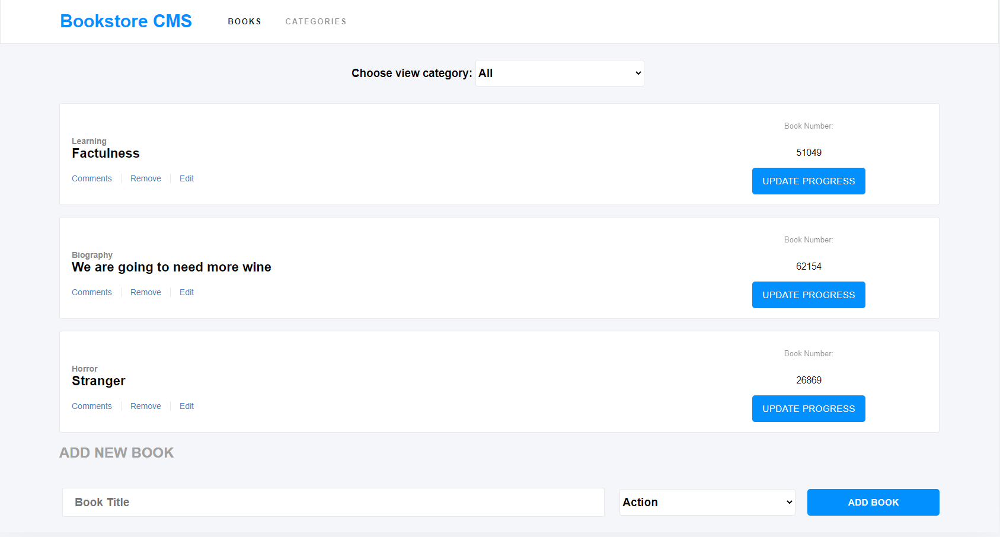

# React-Redux Bookstore App

> This project got bootstrapped with Create React App.

## A summary description of the project and its features underlying features below.

**In this project, we used React and Redux to build a simple application. The project was a real-world project for a fictional company that required our help. The project got split into multiple milestones, and each had functional and technical requirements that all got implemented.**




## Built With

- EcmaScript 6,
- React & Redux,
- Nodejs

## Live Demo

[Live Demo Link](https://glacial-garden-24746.herokuapp.com/)


## Getting Started

**This section contains instructions on setting up the project locally.**

To get a local copy up and running follow these simple example steps.

## Prerequisites

- Have node install
- Knowledge of EcmaScript 6.


## Future features or updates/improvements
- The upcoming updates will consist of:
1. A signup feature for users and profile sections to update, delete and manage their profiles
2. A Share option for books and a way to update books on the site and more improved User interface for the platform.
3. A sign in with social media accounts. 
4. A linkage to Goodreads API to update books and retrieve more books upon a search by the user.

### Setup

```terminal
git clone git@github.com:christianotieno/react-redux-bookstore.git
```

### Install

```terminal
npm install
```

### Usage

```terminal
npm start
```

### Run linter checks

```terminal
npx eslint .
```

### Deployment

- Deployed on Heroku


## Authors

👤 **Christian Otieno**

- Github: [@christianotieno](https://github.com/christianotieno)
- Twitter: [@iamchrisotieno](https://twitter.com/iamchrisotieno)
- Linkedin: [Christian Otieno](https://www.linkedin.com/in/christianotieno/)

👤 **UGWU COLLINS**

- Github: [@collinsugwu](https://github.com/collinsugwu)
- Linkedin: [UGWU COLLINS](https://www.linkedin.com/in/collins-ugwu-25896414a/)

## 🤝 Contributing

Contributions, issues and feature requests are welcome!

Feel free to check the [issues page](https://github.com/christianotieno/react-redux-bookstore/issues).

## Show your support

Give a ⭐️ if you like this project!
